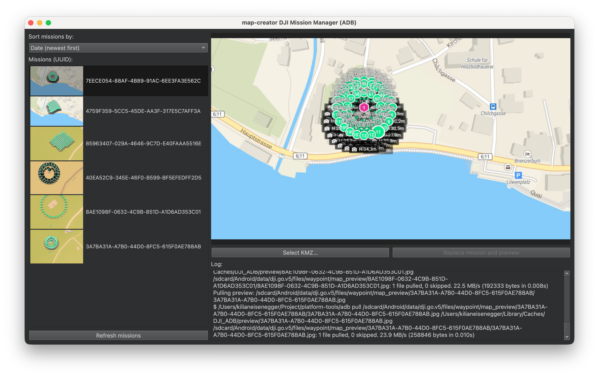

 

# KMZ Injector for DJI – Installation Guide (Windows & macOS)

KMZ Injector for DJI allows you to replace mission KMZ files and preview images on DJI RC, DJI RC 2, DJI RC Enterprise, or any Android tablet running DJI Fly.


The application requires **ADB (Android Debug Bridge)** for communication with the device.  
Because of OS and App Store sandbox restrictions, the application cannot include ADB internally.  
You must install ADB manually and select its path inside the app.

---

# 📦 1. Install ADB

ADB must be installed manually on both Windows and macOS.

---

# 🪟 Windows Installation

## Option A — Official Google SDK (recommended)

1. Download the Platform Tools ZIP:  
   https://developer.android.com/tools/releases/platform-tools

2. Extract it to a location such as:
   ```
   C:\Android\platform-tools\
   ```

3. You will see files like:
   ```
   adb.exe
   fastboot.exe
   ```

4. (Optional) Add the folder to PATH:
   ```
   System Settings → System → About → Advanced System Settings
   → Environment Variables → Path → Add:
   C:\Android\platform-tools\
   ```

5. Test:
   ```
   adb.exe version
   ```

---

# 🍏 macOS Installation

## Option A — Install via Homebrew (recommended)

```bash
brew install android-platform-tools
```

ADB will be here:

- Apple Silicon: `/opt/homebrew/bin/adb`
- Intel macOS: `/usr/local/bin/adb`

## Option B — Install manually

1. Download Platform Tools for macOS:  
   https://developer.android.com/tools/releases/platform-tools

2. Extract to:
   ```
   ~/Android/platform-tools/
   ```

3. Test:
   ```bash
   ~/Android/platform-tools/adb version
   ```

---

# 🔓 2. Enable Developer Mode & USB Debugging (DJI RC / Android)

To allow ADB access, enable the hidden **Developer Options**.

## Enable Developer Mode
1. Open **Settings**  
2. Go to **About Device**  
3. Tap **Build Number** **7 times**  
4. You will see:
   “You are now a developer!”

## Enable USB Debugging
1. Go to **Settings → Developer Options**  
2. Enable:
   - **USB Debugging**  
   - **Install via USB** (if available)  
   - **USB Debugging (Security Settings)** (optional)

3. Connect the device by USB  
4. Accept the popup:
   “Allow USB debugging?” → **Always allow** → OK

---

# 🔌 3. Check ADB Connection

Run:

```bash
adb devices
```

Expected output:

```
List of devices attached
R8YW314JMFD   device
```

If it shows **unauthorized**, accept the prompt on the DJI controller/tablet.

---

# 🚀 4. Configure KMZ Injector for DJI

### On Windows:
Launch:
```
DJI_ADB.exe
```

### On macOS:
Launch:
```
DJI ADB.app
```

### First Launch
The application will ask for the path to your `adb` executable.

Select:
- Windows: `C:\Android\platform-tools\adb.exe`
- macOS (Homebrew): `/opt/homebrew/bin/adb`
- macOS manual install: `~/Android/platform-tools/adb`

The path is saved in `config.yaml`.

---

# 🗂 5. Using KMZ Injector

👉 Download the latest release here:
🔗 https://github.com/hdrpano/ADB-DJI-KMZ-transfer/releases/tag/v1.0.0

### ✔ Load missions  
The app loads missions from the device:
```
/sdcard/Android/data/dji.go.v5/files/waypoint/
```

### ✔ Replace KMZ  
Select a KMZ file → upload to DJI Fly.

### ✔ Replace mission preview  
The app adds a red centered **UPDATED** label to the preview and uploads it to:
```
/sdcard/Android/data/dji.go.v5/files/waypoint/map_preview/<UUID>/<UUID>.jpg
```

DJI Fly will sync missions automatically with DJI Cloud.

---

# 🛠 Troubleshooting

### ❌ ADB server didn't ACK
Run:
```bash
adb kill-server
adb start-server
```

### ❌ Device not listed
Check:
- USB debugging enabled  
- Cable supports data  
- Trusted popup confirmed  
- Windows: correct USB driver installed  

### ❌ Permission denied (macOS)
Run:
```bash
xattr -d com.apple.quarantine <path-to-adb>
```

### ❌ KMZ not uploaded
Check:
- Mission UUID folder exists  
- Storage not full  
- ADB path correct in config.yaml  

---

# 📧 Support

Website: https://map-creator.com  

Thank you for using **KMZ Injector for DJI**!
