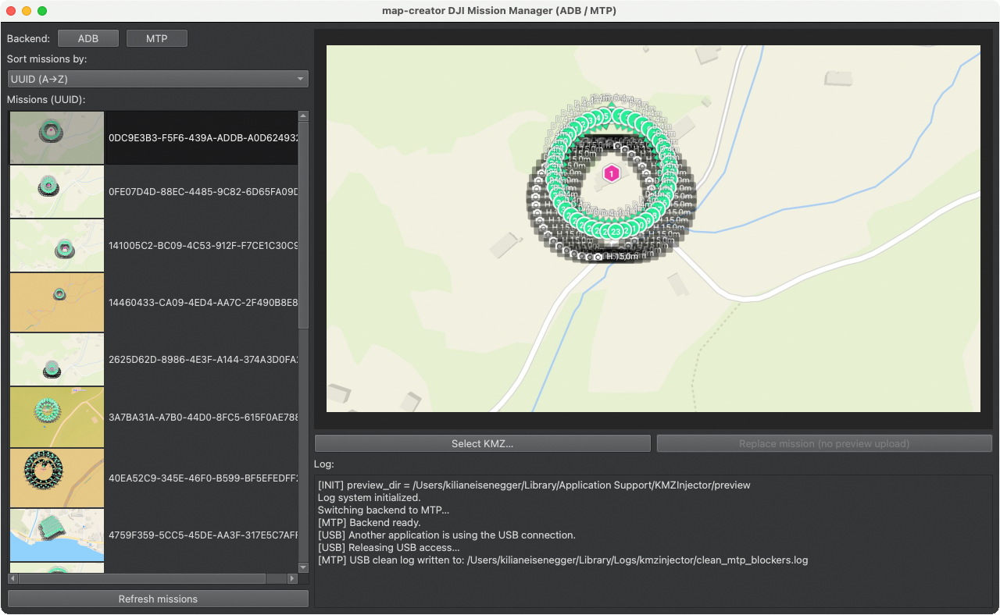

 
 

# DJIKMZInjector

DJIKMZInjector is a lightweight desktop tool to replace DJI waypoint missions (KMZ)
on the DJI RC 2 using either ADB or MTP.

The tool focuses on reliability, transparency, and predictable behavior across macOS and Windows.

---

## Features

- Replace DJI waypoint missions (.kmz) by UUID
- Two connection modes:
  - ADB (fast and very reliable)
  - MTP (no developer mode required)
- Automatic preview image handling
- Safe DJI-compatible mission replacement
- Works on macOS and Windows
- No modification of mission content
- Clean UI without background services

---

## Connection Modes

### ADB (Recommended)

ADB is the fastest and most reliable way to replace missions.

Requirements:
- Android devices
- USB debugging enabled

ADB is recommended if you replace missions frequently or work with large files.

---

### MTP (macOS and Windows)

MTP allows mission replacement without enabling developer mode.

Advantages:
- No ADB required
- Uses standard USB file transfer

Limitations:
- Slower than ADB
- Requires careful handling on macOS

---

## Important macOS MTP Information

macOS does not provide a stable native MTP API comparable to ADB.

Reliable MTP mission replacement on macOS required:
- Handling delayed file visibility
- Working around filesystem caching
- Managing system processes that lock USB access
- Implementing retry and timeout logic
- Strict delete → upload → verify sequencing

The macOS MTP integration required several full days of development and testing
to reach a stable and user-friendly result.

The application automatically releases USB access when required.
No dialogs, no user interaction, and no manual process handling are needed.

---

## Preview Handling

Preview images are treated as a cache.

Behavior:
- On first application start, existing previews are reused
- If a preview is missing, it is pulled from the device
- After mission replacement or manual refresh, previews are reloaded from the device

This ensures the preview always matches the mission stored on the DJI RC 2.

---

## Typical Workflow

1. Connect the DJI RC 2 via USB
2. Select ADB or MTP backend
3. Refresh the mission list
4. Select a mission by UUID
5. Select a replacement KMZ file
6. Replace the mission
7. Preview updates automatically

---

## Technical Design Notes

- ADB and MTP are implemented as separate backends
- The UI never blocks on system dialogs
- Preview files are disposable cache data
- The mission list is the single source of truth
- macOS MTP behavior is treated as eventually consistent

---

## Troubleshooting

### macOS USB Access and Photos App

On macOS, the DJI RC 2 is detected as a media device.
When this happens, Apple’s Photos app or related background services may
automatically connect to the device.

While Photos is connected, it holds exclusive access to the USB MTP interface.
This prevents other applications from accessing mission files.

DJIKMZInjector automatically handles this situation:

- If Photos or related media services are using the USB connection,
  DJIKMZInjector will release USB access automatically.
- No user interaction is required.
- The USB connection itself remains active.
- A device reboot or cable reconnection is **not** necessary.

This behavior allows seamless switching between ADB and MTP using the same USB
connection and avoids unnecessary reconnects or restarts.

This is expected macOS behavior and is handled intentionally to ensure a smooth
and reliable workflow.

### Device not detected (MTP)

- Ensure the DJI RC 2 is unlocked
- Close Photos or other media applications
- Reconnect the USB cable
- Press Refresh

### Preview does not update

- Press Refresh
- The preview cache will be rebuilt automatically

### Mission replacement fails

- Verify the KMZ file is valid
- Ensure the UUID exists on the device
- Try ADB mode if available

---

## map-creator Compatibility

DJIKMZInjector is fully compatible with missions created using map-creator.

If you are looking for a professional DJI waypoint editor, visit:

https://map-creator.com

---

## License

Free for personal and professional use.

No warranty is provided.
Use at your own risk.
