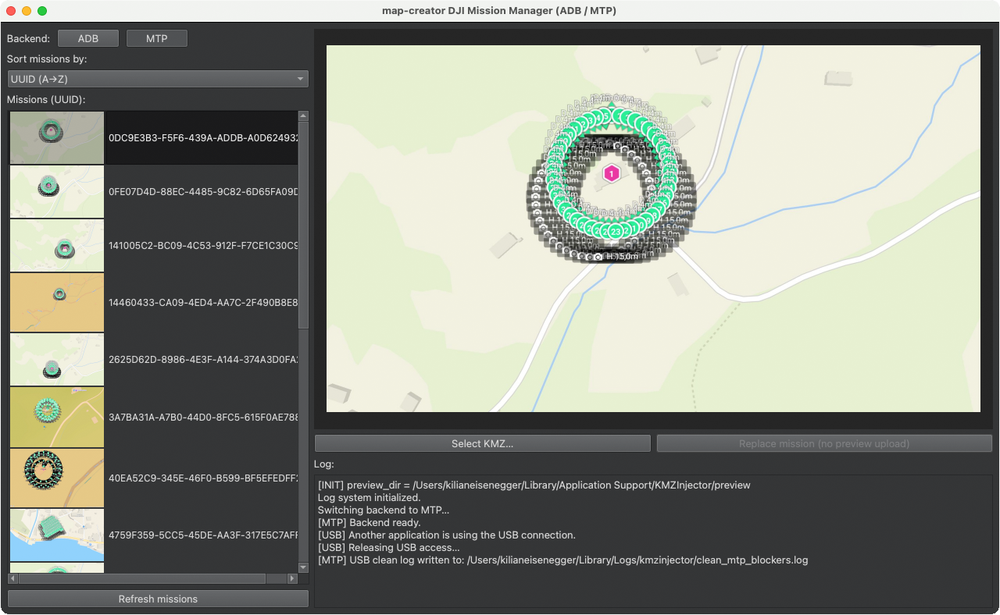
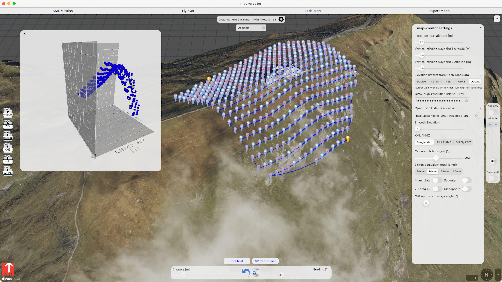

# DJIKMZInjector

DJIKMZInjector is a lightweight desktop tool to manage DJI waypoint missions (.kmz)
on DJI RC controllers and mobile devices using ADB, MTP, and native iOS integration.

The tool focuses on reliability, transparency, and predictable behavior across macOS and Windows.

You can find the latest compiled release here:
[DJI-KMZ-Injector Release](https://github.com/hdrpano/DJI-KMZ-Injector/releases)

---

## Features

- Replace DJI waypoint missions (.kmz) by UUID
- Native iOS mission creation support on macOS
- Automatic device detection and connection
- Automatic preview image handling
- Safe DJI-compatible mission replacement
- Works on macOS and Windows
- No modification of mission content
- Clean UI without background services

---

## Supported Connection Modes

### iOS Backend (macOS)

The new native iOS backend allows direct mission management on iPhone and iPad devices.

Features:
- Direct mission creation without replacing existing missions
- Automatic connection on application startup
- Native Apple device communication
- Full mission database access
- Automatic mission synchronization
- No jailbreak or developer mode required

Advantages:
- Create completely new missions directly from macOS
- Read DJI mission metadata and previews
- Faster and more reliable than manual file workflows

---

### MTP Backend (Android and DJI RC Controllers)

MTP is now the default backend for Android devices and DJI RC controllers.

Advantages:
- No developer mode required
- Standard USB file transfer
- Automatic device detection
- Works on macOS and Windows

Typical supported devices:
- DJI RC 2
- Android phones and tablets
- DJI controllers using Android-based systems

Limitations:
- Slower than ADB
- File visibility delays on some macOS systems

---

### ADB Backend (Optional for Android)

ADB remains available as an advanced backend for Android devices.

ADB is useful for:
- Power users
- Large mission transfers
- Fast repeated testing workflows

Requirements:
- Android devices
- USB debugging enabled

---

## Automatic Device Detection

DJIKMZInjector automatically detects:
- iOS devices
- Android devices
- DJI RC controllers

The correct backend is selected automatically during startup whenever possible.

This allows a plug-and-play workflow without manual backend configuration.

---

## Important macOS MTP Information

Reliable MTP mission handling on macOS required:
- Handling delayed file visibility
- Working around filesystem caching
- Managing system processes that lock USB access
- Implementing retry and timeout logic
- Strict synchronization and verification

The macOS MTP integration required extensive development and testing
to reach a stable and user-friendly result.

### macOS USB Stability

macOS does not properly release USB MTP access when media-related apps
such as Preview, Photos or Image Capture have accessed the device.

This often causes MTP tools to fail until the Mac is rebooted.

DJIKMZInjector automatically detects and terminates known macOS processes
that block USB MTP access, allowing a reliable connection without rebooting.

---

## Preview Handling

Preview images are treated as a local cache.

Behavior:
- Existing previews are reused whenever possible
- Missing previews are downloaded automatically
- After mission changes or refresh operations, previews are synchronized again

This ensures previews always match the actual missions stored on the device.

---

## Typical Workflow

Watch the video:

### iOS Workflow (macOS)

1. Connect the iPhone or iPad via USB
2. Launch DJIKMZInjector
3. Device connects automatically
4. Create or import missions directly
5. Synchronize with DJI Fly

### Android / DJI RC Workflow

1. Connect the device via USB
2. Launch DJIKMZInjector
3. Backend is selected automatically
4. Refresh the mission list
5. Select or replace missions
6. Preview updates automatically

---

## Technical Design Notes

- iOS, ADB, and MTP are implemented as independent backends
- Automatic backend detection on startup
- Preview files are disposable cache data
- Mission databases are synchronized dynamically
- UI operations remain responsive during device access
- macOS MTP behavior is treated as eventually consistent

---

## Troubleshooting

### Device not detected

- Ensure the device is unlocked
- Reconnect the USB cable
- Press Refresh
- Restart the application if necessary

### macOS Photos App conflicts

On macOS, Apple media applications may lock the USB MTP connection.

DJIKMZInjector automatically handles this by releasing blocking processes
without requiring a reboot or cable reconnect.

### Preview does not update

- Press Refresh
- Preview cache will rebuild automatically

### Mission replacement fails

- Verify the KMZ file is valid
- Ensure the UUID exists on the device
- Try another backend if available

### DJI RC firmware update

After DJI RC firmware updates, reboot the controller before using MTP or ADB.

---

## map-creator Compatibility

DJIKMZInjector is fully compatible with missions created using map-creator.

If you are looking for a professional DJI waypoint editor, visit:

https://map-creator.com

---

## License

Free for personal and professional use.

No warranty is provided.
Use at your own risk.
